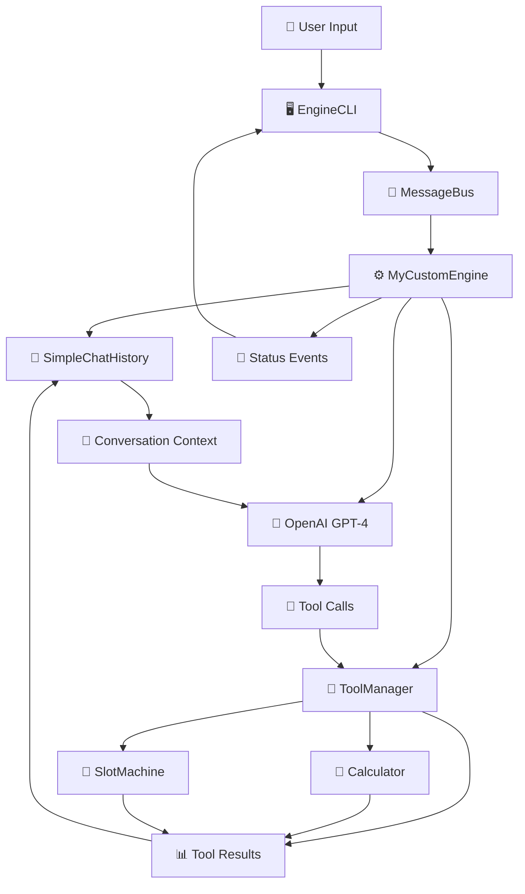
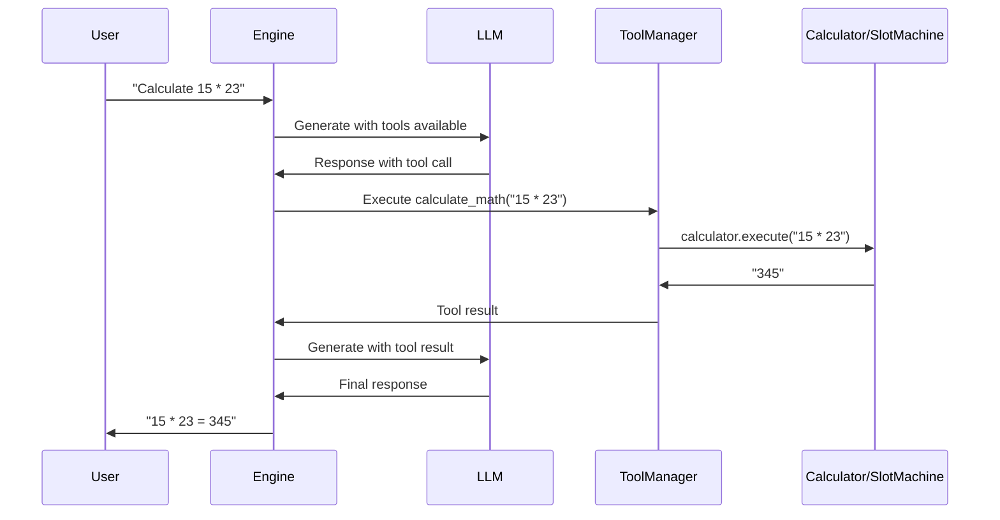

# **"YourEngine.py" - Custom LLM Engine with Tool Integration**

YourEngine is a custom LLM engine built on the LLMgine framework that demonstrates advanced conversation capabilities with tool integration, access to conversation memory, and a clear CLI interface.

---

## ✨ **Key Features**

| Feature | Description | Implementation |
|---------|-------------|----------------|
| **🧮 Mathematical Calculator** | Advanced mathematical expression evaluation | Calculator tool integration |
| **🎰 Slot Machine Game** | Interactive slot machine with betting system | SlotMachine tool integration |
| **💾 Conversation Memory** | Persistent chat history across sessions | SimpleChatHistory context manager |
| **🔄 Tool Execution Loop** | Multi-step tool calling with context updates | OpenAI function calling pattern |
| **🎨 Rich CLI Interface** | Live status updates, tool results, and interactive prompts | EngineCLI with Rich components |
| **⚡ Async Architecture** | Full async/await support for high performance | MessageBus with event-driven design |

---

## 🏗️ **Architecture Overview**



---

## 🚀 **Quick Start**

### 1. **Setup Environment**
```bash
# Create virtual environment
python -m venv .venv
source .venv/bin/activate  # On Windows: .venv\Scripts\Activate.ps1

# Install dependencies
pip install -e .

# Set up environment variables
echo "OPENAI_API_KEY=your_api_key_here" > .env
echo "DATABASE_URL=sqlite:///./llmgine.db" >> .env
```

### 2. **Run YourEngine**
```bash
python programs/engines/yourengine.py
```

### 3. **Start Chatting!**
```
🤖 Welcome to YourEngine! I can help you with calculations and games.

You: Calculate 15 * 23 + 7
🤖 Let me calculate that for you...
🧮 Tool Result: 352

You: Play the slot machine with 50 credits
🤖 Spinning the slot machine...
🎰 Tool Result: 🍒🍊🍇 You won 150 credits! Total balance: 200 credits

You: What was my last calculation?
🤖 Your last calculation was 15 * 23 + 7 = 352. I remember that from our conversation!
```

---

## 🔧 **Engine Components**

### **1. Commands & Events System**
```python
@dataclass
class MyCustomEngineCommand(Command):
    prompt: str = ""
    temperature: Optional[float] = None
    max_tokens: Optional[int] = None

@dataclass
class MyCustomEngineStatusEvent(Event):
    status: str = ""  # "Processing", "Executing tool", "Completed"
```

**Purpose**: Handles user input and communicates engine state to the CLI.

### **2. Core Engine Class**
```python
class MyCustomEngine(Engine):
    def __init__(self, model: Any, system_prompt: Optional[str] = None, session_id: Optional[SessionID] = None):
        self.model = model
        self.context_manager = SimpleChatHistory(...)  # Conversation memory
        self.tool_manager = ToolManager(...)           # Tool execution
        self.bus = MessageBus()                        # Event communication
```

**Features**:
- **Conversation Memory**: Maintains full chat history
- **Tool Management**: Handles tools (Calculator, SlotMachine)
- **Event System**: Real-time status updates

### **3. Tool Integration**
```python
# Calculator Tool
async def calculate_math(expression: str) -> str:
    """Calculate mathematical expressions."""
    return await calculator.execute(expression)

# Slot Machine Tool  
async def play_slot_machine(action: str, bet_amount: int = 10) -> str:
    """Play the slot machine game."""
    return await slot_machine.execute(action, bet_amount)
```

**Capabilities**:
- **Mathematical Expressions**: `2 + 3 * 4`, `sqrt(16)`, `sin(45)`
- **Slot Machine Game**: Spin, check balance, betting system
- **Automatic Tool Selection**: LLM chooses appropriate tools

---

## 🧠 **Conversation Memory System**

YourEngine solves the common chatbot memory problem with `SimpleChatHistory`:

### **Before (Memory Issues)**
```
User: "What's 2+2?"
Bot: "2+2 = 4"
User: "What was my last question?"
Bot: "I don't remember our previous conversation."
```

### **After (With Memory)**
```
User: "What's 2+2?"
Bot: "2+2 = 4"
User: "What was my last question?"
Bot: "You asked me to calculate 2+2, which equals 4."
```

### **Memory Features**
- **Persistent Context**: All messages stored across sessions
- **Tool Call History**: Remembers tool executions and results
- **System Prompts**: Maintains conversation personality
- **Session Isolation**: Separate memory per conversation

---

## 🎮 **Tool Execution Flow**

YourEngine implements the OpenAI function calling pattern:



---

## 🖥️ **CLI Interface**

YourEngine provides a rich, interactive CLI experience:

### **Status Updates**
```
🔄 Processing request...
🔧 Executing tool: calculate_math
✅ Completed
```

### **Tool Results**
```
🧮 Calculator Tool Result:
Expression: 15 * 23 + 7
Result: 352
```

### **Interactive Features**
- **Live Spinners**: Real-time status indicators
- **Tool Result Panels**: Formatted tool execution results
- **Error Handling**: Graceful error display
- **Command History**: Previous interactions visible

---

## 🔧 **Configuration Options**

### **System Prompts**
```python
engine = MyCustomEngine(
    model=Gpt41Mini,
    system_prompt="You are a helpful AI assistant with access to powerful tools...",
    session_id=SessionID("my-custom-engine")
)
```

### **Generation Parameters**
```python
# Temperature control
result = await engine.execute("Hello", temperature=0.7)

# Token limits
result = await engine.execute("Explain quantum physics", max_tokens=500)
```

### **Tool Registration**
```python
# Register custom tools
await engine.register_tool(your_custom_function)

# Clear conversation
await engine.clear_context()

# Set new system prompt
engine.set_system_prompt("You are now a pirate!")
```

---

## 🧪 **Usage Examples**

### **Mathematical Calculations**
```
You: Calculate the area of a circle with radius 5
Bot: Let me calculate that for you...
🧮 Tool Result: Area = π × 5² = 78.54 square units

You: What if the radius was 10?
Bot: For a radius of 10, the area would be π × 10² = 314.16 square units
```

### **Slot Machine Gaming**
```
You: Play the slot machine with 100 credits
Bot: Spinning the slot machine...
🎰 Tool Result: 🍒🍒🍒 JACKPOT! You won 1000 credits! Total: 1100

You: What's my balance now?
Bot: Your current balance is 1100 credits from our slot machine session.
```

### **Conversation Memory**
```
You: My name is Alice
Bot: Nice to meet you, Alice!

You: What's my name?
Bot: Your name is Alice, as you told me earlier in our conversation.
```

---


## 🔍 **Technical Implementation**

### **File Structure**
```
programs/engines/yourengine.py
├── Commands & Events (22-47)
├── Engine Class (49-250)
│   ├── Initialization (52-75)
│   ├── Command Handler (77-90)
│   ├── Core Execution (92-250)
│   └── Tool Management (252-280)
└── CLI Integration (282-380)
```

### **Key Dependencies**
- **LLMgine Framework**: Engine base classes and patterns
- **OpenAI API**: GPT-4 model integration
- **Rich**: CLI interface components
- **SimpleChatHistory**: Conversation memory
- **ToolManager**: Tool Function caller

### **Event Flow**
1. **User Input** → `MyCustomEngineCommand`
2. **Command Processing** → `handle_command()`
3. **Context Retrieval** → `SimpleChatHistory.retrieve()`
4. **LLM Generation** → `model.generate()`
5. **Tool Execution** → `ToolManager.execute_tool_call()`
6. **Result Storage** → `SimpleChatHistory.store_tool_call_result()`
7. **Status Updates** → `MyCustomEngineStatusEvent`