# 🚀 **YourEngine - Custom LLM Engine with Tool Integration**

YourEngine is a custom LLM engine built on the LLMgine framework that demonstrates advanced conversation capabilities with tool integration, persistent memory, and a rich CLI interface. It showcases how to build production-ready AI applications with mathematical computation, gaming features, and intelligent conversation flow.

---

## ✨ **Key Features**

| Feature | Description | Implementation |
|---------|-------------|----------------|
| **🧮 Mathematical Calculator** | Advanced mathematical expression evaluation | Project 1 Calculator tool integration |
| **🎰 Slot Machine Game** | Interactive slot machine with betting system | Project 1 SlotMachine tool integration |
| **💾 Conversation Memory** | Persistent chat history across sessions | SimpleChatHistory context manager |
| **🔄 Tool Execution Loop** | Multi-step tool calling with context updates | OpenAI function calling pattern |
| **🎨 Rich CLI Interface** | Live status updates, tool results, and interactive prompts | EngineCLI with Rich components |
| **⚡ Async Architecture** | Full async/await support for high performance | MessageBus with event-driven design |

---

## 🏗️ **Architecture Overview**

```mermaid
flowchart TD
    User[👤 User Input] --> CLI[🖥️ EngineCLI]
    CLI --> Bus[📡 MessageBus]
    Bus --> Engine[⚙️ MyCustomEngine]
    
    Engine --> Memory[💾 SimpleChatHistory]
    Engine --> Tools[🔧 ToolManager]
    Engine --> LLM[🤖 OpenAI GPT-4]
    
    Tools --> Calc[🧮 Calculator]
    Tools --> Slot[🎰 SlotMachine]
    
    Memory --> Context[📝 Conversation Context]
    Context --> LLM
    
    LLM --> ToolCalls[🔧 Tool Calls]
    ToolCalls --> Tools
    Tools --> Results[📊 Tool Results]
    Results --> Memory
    
    Engine --> Events[📢 Status Events]
    Events --> CLI
```



---

## 🚀 **Quick Start**

### 1. **Setup Environment**
```bash
# Create virtual environment
python -m venv .venv
source .venv/bin/activate  # On Windows: .venv\Scripts\Activate.ps1

# Install dependencies
pip install -e .

# Set up environment variables
echo "OPENAI_API_KEY=your_api_key_here" > .env
echo "DATABASE_URL=sqlite:///./llmgine.db" >> .env
```

### 2. **Run YourEngine**
```bash
python programs/engines/yourengine.py
```

### 3. **Start Chatting!**
```
🤖 Welcome to YourEngine! I can help you with calculations and games.

You: Calculate 15 * 23 + 7
🤖 Let me calculate that for you...
🧮 Tool Result: 352

You: Play the slot machine with 50 credits
🤖 Spinning the slot machine...
🎰 Tool Result: 🍒🍊🍇 You won 150 credits! Total balance: 200 credits

You: What was my last calculation?
🤖 Your last calculation was 15 * 23 + 7 = 352. I remember that from our conversation!
```

---

## 🔧 **Engine Components**

### **1. Commands & Events System**
```python
@dataclass
class MyCustomEngineCommand(Command):
    prompt: str = ""
    temperature: Optional[float] = None
    max_tokens: Optional[int] = None

@dataclass
class MyCustomEngineStatusEvent(Event):
    status: str = ""  # "Processing", "Executing tool", "Completed"
```

**Purpose**: Handles user input and communicates engine state to the CLI.

### **2. Core Engine Class**
```python
class MyCustomEngine(Engine):
    def __init__(self, model: Any, system_prompt: Optional[str] = None, session_id: Optional[SessionID] = None):
        self.model = model
        self.context_manager = SimpleChatHistory(...)  # Conversation memory
        self.tool_manager = ToolManager(...)           # Tool execution
        self.bus = MessageBus()                        # Event communication
```

**Features**:
- **Conversation Memory**: Maintains full chat history
- **Tool Management**: Handles Project 1 tools (Calculator, SlotMachine)
- **Event System**: Real-time status updates

### **3. Tool Integration**
```python
# Calculator Tool
async def calculate_math(expression: str) -> str:
    """Calculate mathematical expressions."""
    return await calculator.execute(expression)

# Slot Machine Tool  
async def play_slot_machine(action: str, bet_amount: int = 10) -> str:
    """Play the slot machine game."""
    return await slot_machine.execute(action, bet_amount)
```

**Capabilities**:
- **Mathematical Expressions**: `2 + 3 * 4`, `sqrt(16)`, `sin(45)`
- **Slot Machine Game**: Spin, check balance, betting system
- **Automatic Tool Selection**: LLM chooses appropriate tools

---

## 🧠 **Conversation Memory System**

YourEngine solves the common chatbot memory problem with `SimpleChatHistory`:

### **Before (Memory Issues)**
```
User: "What's 2+2?"
Bot: "2+2 = 4"
User: "What was my last question?"
Bot: "I don't remember our previous conversation."
```

### **After (With Memory)**
```
User: "What's 2+2?"
Bot: "2+2 = 4"
User: "What was my last question?"
Bot: "You asked me to calculate 2+2, which equals 4."
```

### **Memory Features**
- **Persistent Context**: All messages stored across sessions
- **Tool Call History**: Remembers tool executions and results
- **System Prompts**: Maintains conversation personality
- **Session Isolation**: Separate memory per conversation

---

## 🎮 **Tool Execution Flow**

YourEngine implements the OpenAI function calling pattern:


---

## 🖥️ **CLI Interface**

YourEngine provides a rich, interactive CLI experience:

### **Status Updates**
```
🔄 Processing request...
🔧 Executing tool: calculate_math
✅ Completed
```

### **Tool Results**
```
🧮 Calculator Tool Result:
Expression: 15 * 23 + 7
Result: 352
```

### **Interactive Features**
- **Live Spinners**: Real-time status indicators
- **Tool Result Panels**: Formatted tool execution results
- **Error Handling**: Graceful error display
- **Command History**: Previous interactions visible

---

## 🔧 **Configuration Options**

### **System Prompts**
```python
engine = MyCustomEngine(
    model=Gpt41Mini(Providers.OPENAI),
    system_prompt="You are a helpful AI assistant with access to powerful tools...",
    session_id=SessionID("my-custom-engine")
)
```

### **Generation Parameters**
```python
# Temperature control
result = await engine.execute("Hello", temperature=0.7)

# Token limits
result = await engine.execute("Explain quantum physics", max_tokens=500)
```

### **Tool Registration**
```python
# Register custom tools
await engine.register_tool(your_custom_function)

# Clear conversation
await engine.clear_context()

# Set new system prompt
engine.set_system_prompt("You are now a pirate!")
```

---

## 🧪 **Usage Examples**

### **Mathematical Calculations**
```
You: Calculate the area of a circle with radius 5
Bot: Let me calculate that for you...
🧮 Tool Result: Area = π × 5² = 78.54 square units

You: What if the radius was 10?
Bot: For a radius of 10, the area would be π × 10² = 314.16 square units
```

### **Slot Machine Gaming**
```
You: Play the slot machine with 100 credits
Bot: Spinning the slot machine...
🎰 Tool Result: 🍒🍒🍒 JACKPOT! You won 1000 credits! Total: 1100

You: What's my balance now?
Bot: Your current balance is 1100 credits from our slot machine session.
```

### **Conversation Memory**
```
You: My name is Alice
Bot: Nice to meet you, Alice!

You: What's my name?
Bot: Your name is Alice, as you told me earlier in our conversation.
```

---

## 🚀 **Extending YourEngine**

### **Adding New Tools**
```python
async def weather_tool(city: str) -> str:
    """Get weather information for a city."""
    return f"Weather in {city}: Sunny, 22°C"

await engine.register_tool(weather_tool)
```

### **Custom System Prompts**
```python
engine.set_system_prompt("""
You are a helpful AI assistant with expertise in:
- Mathematics and calculations
- Gaming and entertainment
- General knowledge and conversation

Always be encouraging and provide detailed responses.
""")
```

### **Multiple Engine Instances**
```python
# Math-focused engine
math_engine = MyCustomEngine(
    model=Gpt41Mini(Providers.OPENAI),
    system_prompt="You are a math tutor...",
    session_id=SessionID("math-session")
)

# Gaming-focused engine  
game_engine = MyCustomEngine(
    model=Gpt41Mini(Providers.OPENAI),
    system_prompt="You are a game master...",
    session_id=SessionID("game-session")
)
```

---

## 🔍 **Technical Implementation**

### **File Structure**
```
programs/engines/yourengine.py
├── Commands & Events (22-47)
├── Engine Class (49-250)
│   ├── Initialization (52-75)
│   ├── Command Handler (77-90)
│   ├── Core Execution (92-250)
│   └── Tool Management (252-280)
└── CLI Integration (282-380)
```

### **Key Dependencies**
- **LLMgine Framework**: Engine base classes and patterns
- **OpenAI API**: GPT-4 model integration
- **Rich**: CLI interface components
- **SimpleChatHistory**: Conversation memory
- **ToolManager**: Function calling orchestration

### **Event Flow**
1. **User Input** → `MyCustomEngineCommand`
2. **Command Processing** → `handle_command()`
3. **Context Retrieval** → `SimpleChatHistory.retrieve()`
4. **LLM Generation** → `model.generate()`
5. **Tool Execution** → `ToolManager.execute_tool_call()`
6. **Result Storage** → `SimpleChatHistory.store_tool_call_result()`
7. **Status Updates** → `MyCustomEngineStatusEvent`

---

## 🎯 **Why YourEngine?**

### **Production Ready**
- ✅ **Error Handling**: Graceful failure recovery
- ✅ **Memory Management**: Persistent conversation context
- ✅ **Tool Integration**: Seamless function calling
- ✅ **CLI Experience**: Rich, interactive interface

### **Extensible Architecture**
- ✅ **Modular Design**: Easy to add new tools
- ✅ **Event-Driven**: Decoupled components
- ✅ **Async Support**: High-performance operations
- ✅ **Session Isolation**: Multiple conversation contexts

### **Developer Friendly**
- ✅ **Clear Patterns**: Follows LLMgine engine guide
- ✅ **Type Safety**: Full type annotations
- ✅ **Documentation**: Comprehensive docstrings
- ✅ **Testing Ready**: Structured for unit tests

---

## 🚀 **Get Started Today**

YourEngine demonstrates the power of the LLMgine framework for building sophisticated AI applications. Whether you're building chatbots, calculation tools, or interactive games, YourEngine provides the foundation for creating memorable user experiences.

**Ready to build your own engine?** Start with YourEngine as your template and customize it for your specific use case!

---

> *"From simple calculations to complex conversations, YourEngine shows what's possible when you combine the right tools with intelligent conversation flow."*