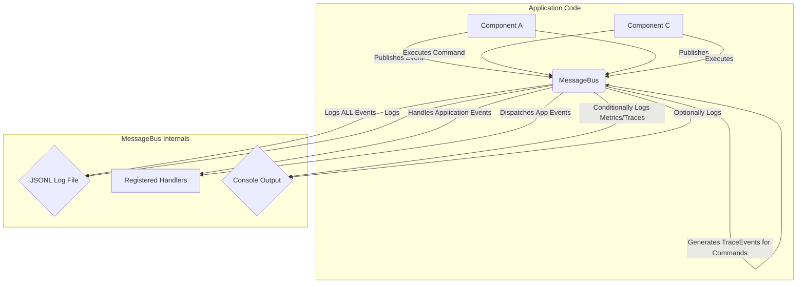

# Observability Architecture

LLMgine provides built-in observability features integrated directly into the `MessageBus`.

## Key Components

### Events (`llmgine.observability.events`)

Structured dataclasses represent different types of observability information:

-   `LogEvent`: For structured application logs (though standard logging is often simpler).
-   `MetricEvent`: Contains a list of `Metric` objects (name, value, unit, tags).
-   `TraceEvent`: Represents a span in a distributed trace, containing `SpanContext` (trace_id, span_id, parent_span_id), timing, status, attributes, etc.

### MessageBus Integration

The `MessageBus` (`llmgine.bus.MessageBus`) is responsible for:

1.  **Universal Event Logging**: Automatically serializing *every* event published to it (both application events and observability events) into a configurable JSONL file. This provides a complete, structured audit trail.
2.  **Automatic Command Tracing**: Generating `TraceEvent`s for the start and end of every command executed via `message_bus.execute()`. These traces capture execution time, success/failure status, and command details.
3.  **Conditional Console Output**: Optionally printing formatted `MetricEvent`s and `TraceEvent`s to the console based on configuration passed during `MessageBus` initialization.



## Usage

### Initialization

Configure observability features when creating the `MessageBus`:

```python
from llmgine.bus import MessageBus

message_bus = MessageBus(
    log_dir="app_logs",           # Directory for the JSONL event log
    log_filename="events.jsonl",  # Specific name for the log file
    enable_console_metrics=True, # Print metrics to console?
    enable_console_traces=False  # Don't print traces to console?
)

# Start the bus (starts background processing)
await message_bus.start()
```

### Logging

-   **Automatic Event Log**: All events published to the bus are automatically logged to the configured JSONL file.
-   **Standard Logging**: Use standard Python `logging` for component-level logs (e.g., `logger.info("Processing item...")`). Configure Python logging handlers (e.g., `logging.StreamHandler`, `logging.FileHandler`) as needed.

### Metrics

Publish `MetricEvent`s containing one or more `Metric` objects:

```python
from llmgine.observability import Metric, MetricEvent

# Single metric
await message_bus.publish(MetricEvent(
    metrics=[Metric(name="items_processed", value=1, tags={\"type\": \"widget\"})]
))

# Multiple metrics
await message_bus.publish(MetricEvent(
    metrics=[
        Metric(name="queue_size", value=15),
        Metric(name="processing_time", value=0.5, unit=\"seconds\")
    ]
))
```

If `enable_console_metrics` was `True`, these will be printed to the console.

### Tracing

-   **Automatic Command Tracing**: Traces for commands executed via `message_bus.execute()` are generated automatically.
-   **Custom Tracing**: You can create custom spans by publishing `TraceEvent`s directly. This is useful for tracing operations not triggered by a bus command.

```python
import uuid
from datetime import datetime
from llmgine.observability import TraceEvent, SpanContext

trace_id = str(uuid.uuid4())
span_id = str(uuid.uuid4())
span_context = SpanContext(trace_id=trace_id, span_id=span_id)

# Publish start event
await message_bus.publish(TraceEvent(
    name="My Custom Operation",
    span_context=span_context,
    start_time=datetime.now().isoformat(),
    attributes={\"input_size\": 1024}
))

# ... perform the operation ...

# Publish end event
await message_bus.publish(TraceEvent(
    name="My Custom Operation",
    span_context=span_context, # Use the same context
    end_time=datetime.now().isoformat(),
    status="OK", # or \"ERROR\"
    attributes={\"output_size\": 2048}
))
```

If `enable_console_traces` was `True`, summaries of these trace events (start/end) will be printed to the console.

## Configuration

The `MessageBus` constructor takes the following observability-related arguments:

-   `log_dir` (str): Directory for the JSONL event log file (default: "logs").
-   `log_filename` (Optional[str]): Specific filename for the JSONL log. If `None`, a timestamped filename is generated (default: `None`).
-   `enable_console_metrics` (bool): Whether to print `MetricEvent` details to the console via standard logging (default: `True`).
-   `enable_console_traces` (bool): Whether to print `TraceEvent` start/end summaries to the console via standard logging (default: `True`).